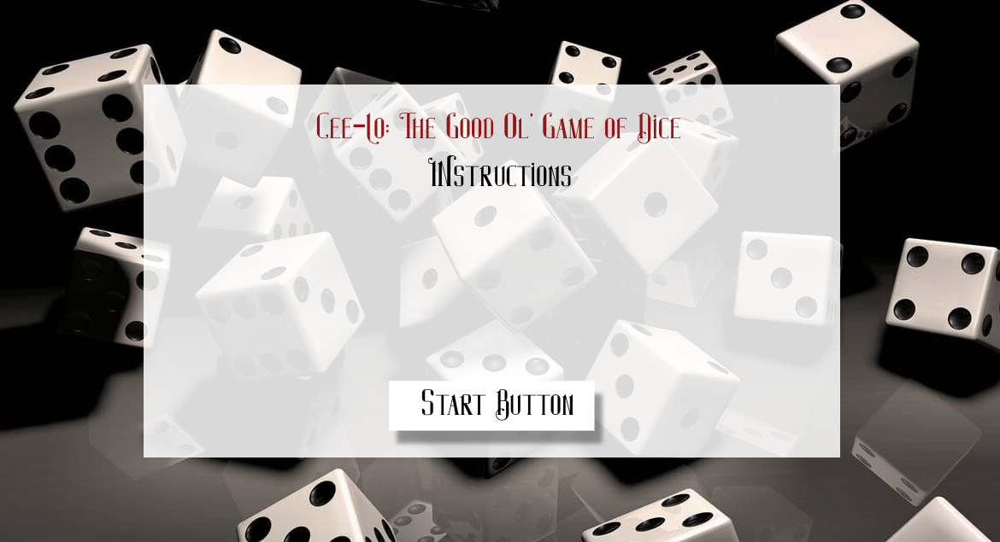
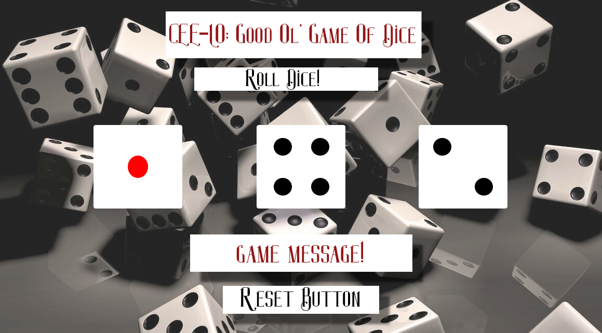
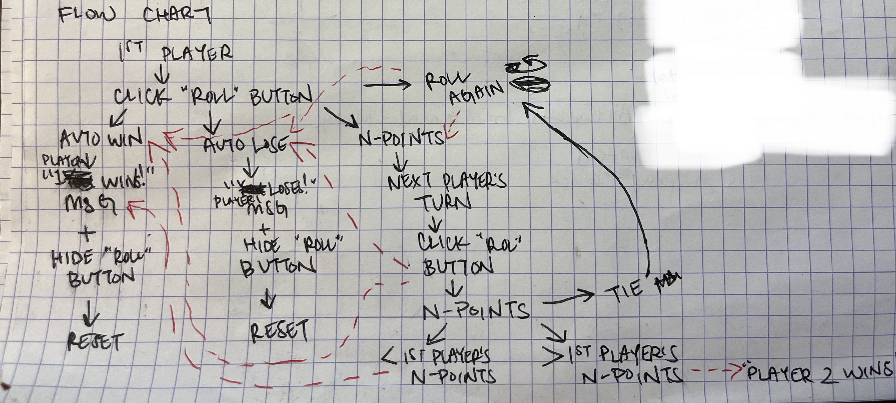
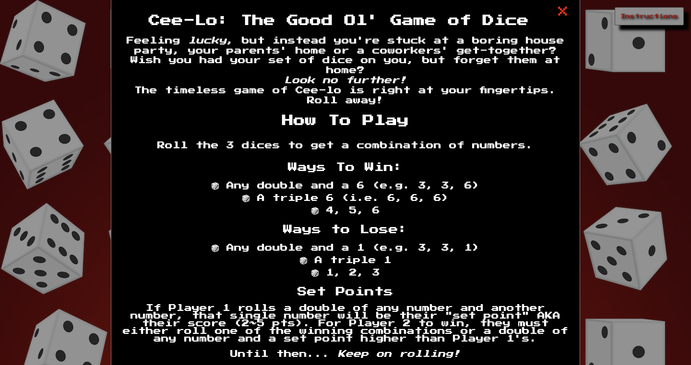
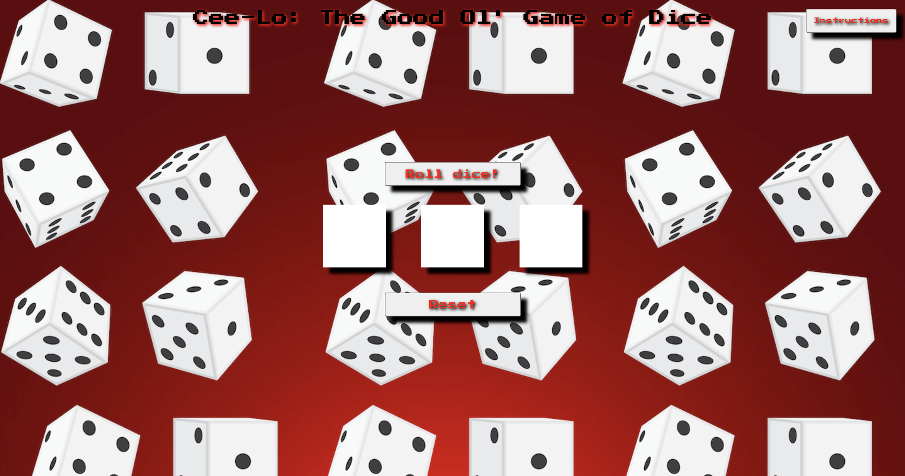
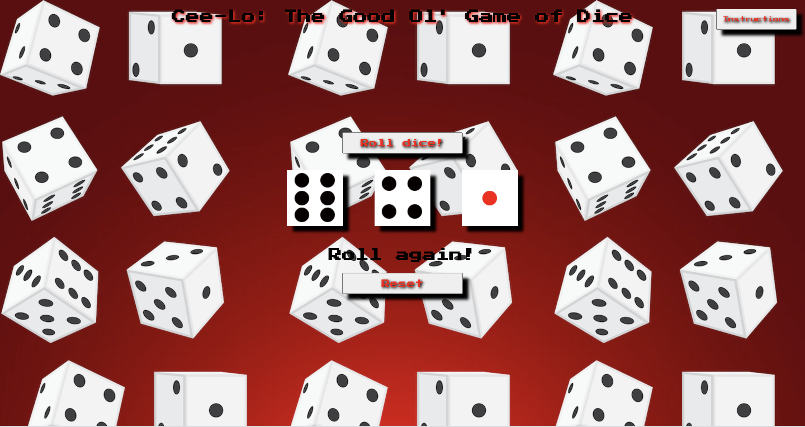
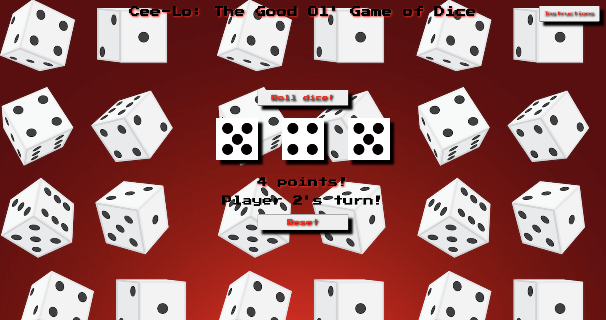

# Project 1
___
## Cee-Lo: The Good Ol' Game of Dice
___
Feeling _**lucky**_, but instead you're stuck at a boring house party, your parents' home or a coworkers' get-together? Wish you had your set of dice on you, but forgot them at home? *Look no further!* The timeless game of **Cee-lo** is right at your fingertips. With this two-player game, users can simply click the "Roll dice!" button to get a combination of three random numbers. Depending on the combination, users 1) automatically win, 2) automatically lose, 3) get a set point or 4) roll again. 

**Automatic Win Combinations:**
* Any double and a 6 (e.g. 3, 3, 6)
* A triple 6 (i.e. 6, 6, 6)
* 4, 5, 6

**Automatic Lose Combinations:**
* Any double and a 1 (e.g. 3, 3, 1)
* A triple 1
* 1, 2, 3 

**Set Point Combinations:**
* A double of any number and any single number (called the **"set point"**)

_This set point will be the player's score. For another player to win, they will either have to roll a winning combination OR a double of any number with a set point higher than the other player's._

**Roll Again Combinations**
* Any combination that does not contain a double or a triple 

_Players will roll again until they roll one of the three combinations above._

## Tech Stack
___
* HTML/CSS 
* Javascript - _**DOM**_

## Wireframes & Flowchart
___
* Start Screen / Instructions 



* Playing Screen



* Flowchart (Planning Document)

## Screenshots of Actual Game

___
* Start Screen Modal With Instructions



* Game Screen Pre-Roll



* Game Screen When Player Must Roll Again


* Game Screen After Player 1 Gets Set Point



https://aimeemisaki.github.io/Project1_Ceelo/

## MVP Goals Reached
___
* ✅ Render start screen/modal that displays instructions that disasapears after clicking exit button to go to game screen (_Extra: 1. users can also click outside of modal to exit to game screen and 2. created an "Instructions" button on game screen that allows users to return to start screen/modal_)
* ✅ Render game screen with 3 dices
* ✅ Render random number generator (text inserted) for the dices that are being rolled (_Extra: numbers are assigned to dice images_)
* ✅ Create conditional combinations for automatic win, automatic loss and roll again (_Extra: created conditionals for when players get n-points for 2-player game_)

```javascript
const autoWinningCombos = [
  116, 161, 611, 226, 262, 622, 336, 363, 633, 446, 464, 644, 556, 565, 655,
  456, 654, 546, 645, 564, 465, 666,
];

const autoLosingCombos = [
  111, 221, 212, 122, 331, 313, 133, 441, 414, 144, 551, 515, 155, 661, 616,
  166, 123, 231, 321, 312, 213, 132,
];

```

* ✅ Roll again message when players do not roll any automatic win/lose combinations
* ✅ Message that pops up declaring player has won, lost or must roll again
* ✅ Functional button to roll dice

```javascript
const buttonPlay = document.querySelector(".gs-roll-button");
buttonPlay.addEventListener("click", function () {
  dices.forEach(function (dice) {
    dice.innerText = diceNum();
  });
  gameMessage.innerText = "";
  let playNumbers = "";
  dices.forEach(function (dice) {
    playNumbers += dice.innerText;
  });
  gameResult(parseInt(playNumbers));
  displayImage();
  if (currentPlayer === "Player 1") {
    player1Score(playNumbers);
  } else if (currentPlayer === "Player 2") {
    player2Score(playNumbers);
  }
  if (player2 > 1) {
    setpointResults();
  }
  playersTurn();
})
```

* ✅ Functional reset button

```javascript
resetButton.addEventListener("click", function () {
  dices.forEach(function (dice) {
    dice.style.backgroundImage = "none";
  });
  buttonPlay.style.display = "inline-block";
  gameMessage.innerText = "";
  pointMessage.innerText = "";
  winnerMessage.innerText = "";
  playersTurnMessage.innerText = "";
  player1 = 0;
  player2 = 0;
  currentPlayer = "Player 1";
})
```

## Stretch Goals Reached 
___
* ✅ Make it a 2-person game
* ✅ Store points for Player 1 and Player 2 (_making conditionals for set-points and ties)_

```javascript
// Conditionals for game results

function gameResult(playNumbers) {
  if (autoWinningCombos.includes(playNumbers)) {
    winnerMessage.innerText = currentPlayer + " won!";
    gameMessage.innerText = "Game Over!";
    buttonPlay.style.display = "none";
    pointMessage.innerText = "";
    playersTurnMessage.innerText = "";
    return;
  } else if (autoLosingCombos.includes(playNumbers)) {
    winnerMessage.innerText = currentPlayer + " lost!";
    gameMessage.innerText = "Game Over!";
    buttonPlay.style.display = "none";
    pointMessage.innerText = "";
    playersTurnMessage.innerText = "";
    return;
  } else if (twoPoints.includes(playNumbers)) {
    pointMessage.innerText = "2 points!";
  } else if (twoPoints.includes(playNumbers)) {
    pointMessage.innerText = "2 points!";
  } else if (threePoints.includes(playNumbers)) {
    pointMessage.innerText = "3 points!";
  } else if (fourPoints.includes(playNumbers)) {
    pointMessage.innerText = "4 points!";
  } else if (fivePoints.includes(playNumbers)) {
    pointMessage.innerText = "5 points!";
  } else {
    gameMessage.innerText = "Roll again!";
    pointMessage.innerText = "";
  }
  if (pointMessage.style.visibility == "hidden") {
    pointMessage.style.visibility = "visible";
  }
}
```

```javascript
let player1 = 0;
let player2 = 0;

// When Player 1 gets set-points

function player1Score(player1Numbers) {
  if (twoPoints.includes(parseInt(player1Numbers))) {
    player1 += 2;
  } else if (threePoints.includes(parseInt(player1Numbers))) {
    player1 += 3;
  } else if (fourPoints.includes(parseInt(player1Numbers))) {
    player1 += 4;
  } else if (fivePoints.includes(parseInt(player1Numbers))) {
    player1 += 5;
  }
}

// When Player 2 gets set-points

function player2Score(player2Numbers) {
  if (twoPoints.includes(parseInt(player2Numbers))) {
    player2 += 2;
  } else if (threePoints.includes(parseInt(player2Numbers))) {
    player2 += 3;
  } else if (fourPoints.includes(parseInt(player2Numbers))) {
    player2 += 4;
  } else if (fivePoints.includes(parseInt(player2Numbers))) {
    player2 += 5;
  }
}
```

```javascript
// Conditionals for when Player 1 or Player 2 wins or a Tie occurs

function setpointResults() {
  if (player1 === player2 && player1 > 0 && player2 > 0) {
    winnerMessage.innerText = "Tie!";
    playersTurnMessage.innerText = "Play again!";
  } else if (player2 > player1) {
    winnerMessage.innerText = "Player 2 wins!";
    gameMessage.innerText = "Game Over";
    buttonPlay.style.display = "none";
    playersTurnMessage.style.display = "none";
  } else if (player1 > player2) {
    winnerMessage.innerText = "Player 1 wins!";
    gameMessage.innerText = "Game Over";
    buttonPlay.style.display = "none";
    playersTurnMessage.style.display = "none";
  }
}
```

```javascript
// Toggling from Player 1 to Player 2

let currentPlayer = "Player 1";
function playersTurn() {
  if (player1 > 1) {
    currentPlayer = "Player 2";
    playersTurnMessage.innerText = "Player 2's turn!";
  } else {
    currentPlayer = "Player 1";
  }
}
```

## Approach, Ongoing Bugs & Refactorings
___

While I was able to reach my MVP goals without any major roadblocks, when I began to try to make the game a 2-player game, I soon realized, while going through the possible conditionals (set-points and ties), that this was much a harder task than I had expected. This was really my major roadblock.

I approached this issue by...
* Storing the two players' scores in seperate functions
* Creating a seperate set of conditionals for when Player 1 had a higher set-point than Player 2 and vice versa, as well as when they reached a tie in set-points
* Creating more HTML tags for different messages (declaring 1. points, 2. winners, 3. game statuses and 4. whose turn it was). 
* Making sure that conditionals for toggling between players were set under my "Play" button which is the main functioning button that affects the game


I was able to achieve most of the 2-player functionalities. _However..._

**Ongoing Bugs**
* Still unable to not have "2nd player's turn!" dissappear when Player 2 is continuing to roll

**Refactorings in the Future**
* Make JS code cleaner and more simple to follow
* Add animation so dices are actually rolling
* Add background music
* Make it a multi-player game (3 players or more)
* Make it accessible for mobile users and other screens

**References**

1. [Modal HTML/CSS/JS Code by W3 School](https://www.w3schools.com/howto/howto_css_modals.asp)

2. [Fist Cursor by Freepik](https://www.flaticon.com/free-icons/fist)

3. [Hand Cursor by Freepik](https://www.flaticon.com/free-icons/hand)

4. [Finger Cursor by Freepik](https://www.flaticon.com/free-icons/finger)

5. [Instructions Icon by Freepik](https://www.flaticon.com/free-icons/instructions)

