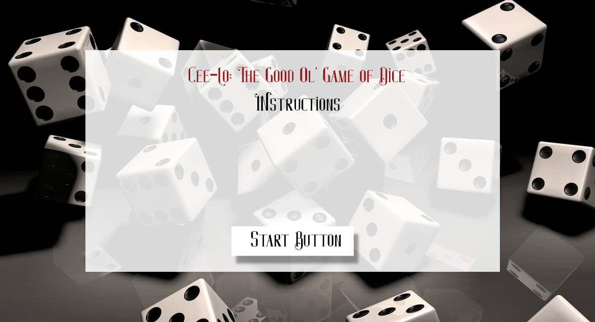
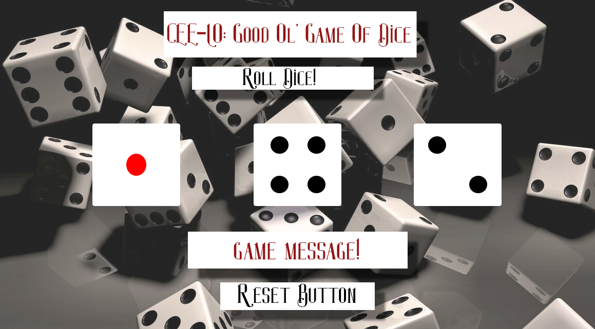

# Project 1
___
## Cee-Lo 四五六: The Good Ol' Game of Dice
___
Feeling _**lucky**_, but instead you're stuck at a boring house party, your parents' house or a coworkers' get-together? Wish you had your set of dice on you, but forget them at home? *Look no further!* The timeless game of **Cee-lo** is right at your fingertips. Roll away! 

## Tech Stack
___
* HTML/CSS 
* Javascript - DOM 

## Wireframes
___
* Start Screen / Instructions 

* Playing Screen

## MVP Goals
___
* Render start screen that displays instructions that disasapears after clicking button to go to game screen
* Render game screen with 3 dices
* Render 3 random number generators (text inserted) for the dices that are being rolled
* Create conditional combinations for automatic win, automatic loss and roll again
* Automatically reset game when player must roll again
* Functional buttons to start and reset game
* Message that pops up declaring player has won, lost or must roll again

## Stretch Goals 
___
* Add animation for dice roll
* Make it a 2-person game
* Store points for Player 1 and Player 2